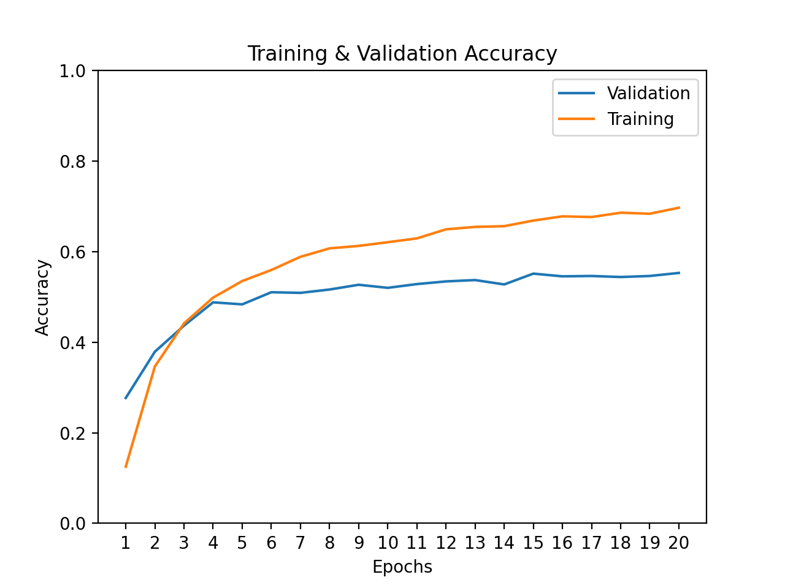
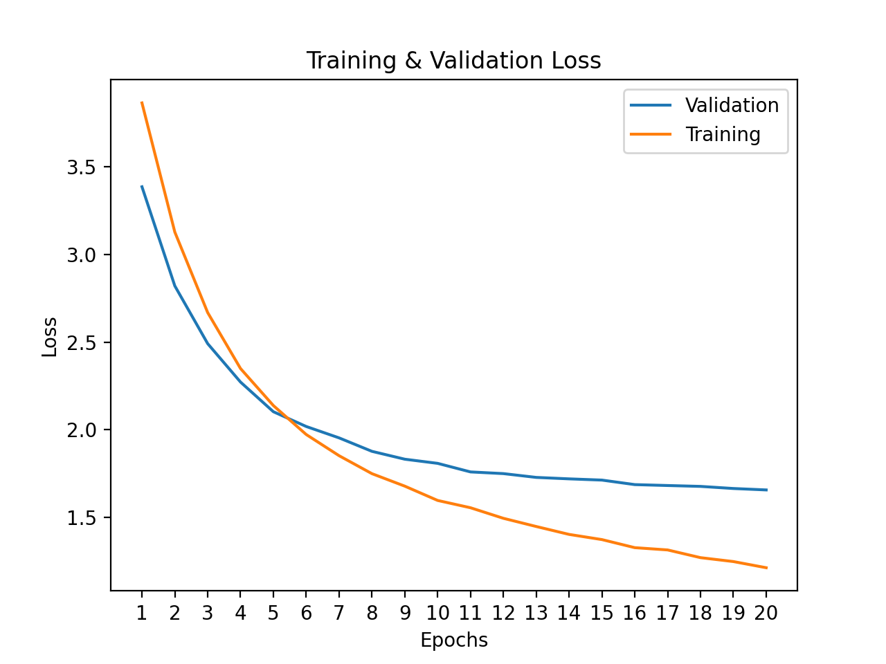

# Resnet Analysis

### DATA
*Non-quantized model*
* Size of saved parameters: `94.9 MB` 
* Acc: `55.30%`
* Inference speed was `249.87ms` per sample at batch size 8
* Inference speed was `232.53ms` per sample at batch size 16

*Quantized Model*
* Size of saved parameters: `24.2 MB` 
* Acc: `54.78%`
* Inference speed was `53.49ms` per sample at batch size 8
* Inference speed was `66.04ms` per sample at batch size 16

*Speedup*
* 241ms average vs 59.7ms
* ~= **4x speedup**

### Analysis

For reference, all of this code was run on my personal MacBook Air (2019). 

##### Fine-tuning
For this task, I fine-tuned a quantizeable implementation of Resnet-50 from PyTorch. 
I implemented the logic to prepare the dataset in the `indoor_dataset.py` file, which 
contains the IndoorDataset class, a subclass of ‘torch.utils.data.Dataset’. The training 
and validation split is provided by the maintainers of the MIT Indoor-67 dataset. The 
files are `Test Images.txt` and `Train Images.txt` under the `data/` dir. 

These are the results after 20 epochs of training.

The validation accuracy nearly plateaued around `55%`, whereas training accuracy 
was still increasing at about `69%`. This `14%` difference clearly indicates that the 
model has high variance. I did not use any image transformations for dataset preparation 
other than resizing it. I even forgot to scale the RGB values from int values in the range
of 0-225 to floats between 0-1. 
So it’s very understandable that the model didn’t turn out to be super robust. It took 
about 8 hours to train on my computer, so I did not have time to retrain with better 
feature engineering. 

##### Quantization

My first attempt at quantizing the fine-tuned model failed. The model would predict 
one particular class for all datapoint, which meant accuracy dropped to `1/67` 
(aka broken clock). I used the same source code from pytorch, so I figured the 
problem was in there. Then I realized that `torchvision.models.quantization.utils.quantize_model` 
was using a hardcoded *dummy input data* to prepare the model for quantization. 

    _dummy_input_data = torch.rand(1, 3, 299, 299)  # <- PyTorch source code

As I mentioned, since my dataset was composed of features with values ranging from 0 to 255,
the quantization was not calibrated appropriately. I copied the code in that file (see `utils/quantization`)
and removed the hardcoded variable so that I could pass in a sample from my prepared dataset as a
better example to calibrate with. This worked, and the model quantized successfully. The drop in validation 
accuracy was less than `1%` (or `0.52%` to be exact).

As for inference speed, we see about a 4x speed up with the quantized model. The reason is attributable 
to the 4x decrease in memory footprint at each layer of the model. With quantization, 
the model parameters are converted from float32 to int8, which has 1/4th the number of 
bits. Having 4x less memory means the network load is reduced by 4x. This should be the main
source of performance gain.

I considered if int8 matrix multiplications would faster as well. However, I don't 
think this is the case. On my local hardware, the compute time of the matrix multiplication 
should not improve by downcasting float32 to int8 since the underlying hardware probably 
does not support specialized 8-bit operations. So the compute time should be approximately 
the same as if the model was float32.

*Note*: 
    
    These python scripts do not support GPU compute without the necessary code modifications. 
