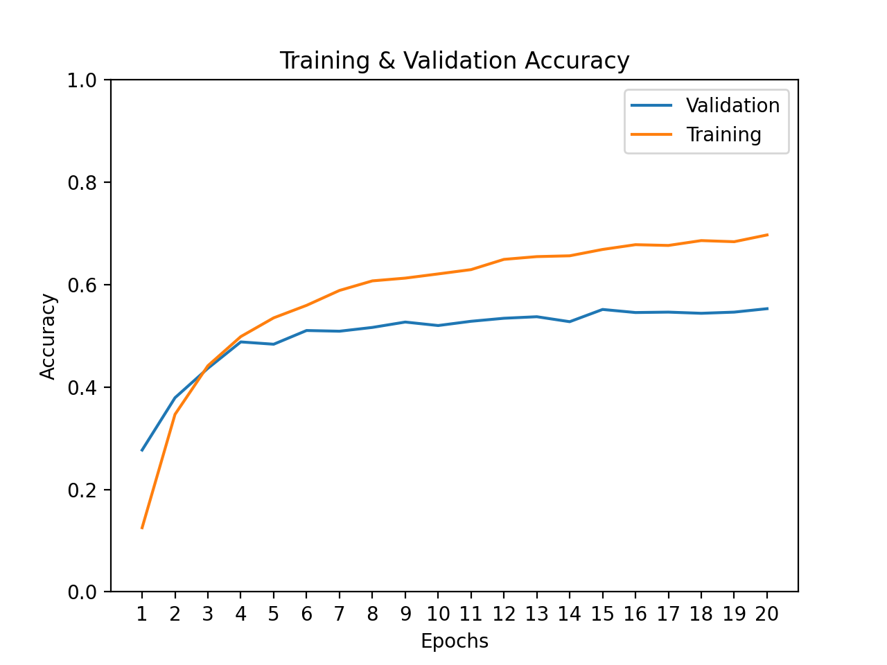

# resnet50-finetuning-and-quantization
Experiment to finetune a resnet50 model in pytorch to the MIT Indoor-67 dataset. 
Then I optimize for inference speed using 
[Pytorch's implementation](https://pytorch.org/docs/stable/quantization.html) 
of [quantization for Resnet](https://github.com/pytorch/vision/blob/master/torchvision/models/quantization/resnet.py).

## Reproducing experiment

#### (Optional) Environment Setup
You can set up your environment however you like. I use `conda` and `pip install` the
dependencies in `requirements.txt` as follows

        > conda create -n exam_env python=3.8
        > conda activate exam_env
        > pip install requirements.txt

#### MIT Indoor-67 Dataset Preparation

Please take a look at [source page](http://web.mit.edu/torralba/www/indoor.html) for this dataset.
Download the dataset, unzip it, and move the resulting `Images` folder
into the `data` directory.

Link to site: http://web.mit.edu/torralba/www/indoor.html

Link to download tar file (2.4GB): http://groups.csail.mit.edu/vision/LabelMe/NewImages/indoorCVPR_09.tar

#### Fine-tuned model weights
The fine-tuned model weights are provided for convenience so that you don't have to train it. 
With that, you should be able to run `evalaute.py` to compared the accuracy and speed of the 

## Results

These are the results after fine-tuning for 20 epochs on just a 5k sample of data.

Credits:

Here is a repo that fine-tuned a Resnet152 model on this same dataset. 
[cta-ai/resnet-finetune-demo](https://github.com/cta-ai/resnet-finetune-demo)

[PyTorch Quantizeable Resnet Model Source Code](https://github.com/pytorch/vision/blob/1b7c0f54e2913e159394a19ac5e50daa69c142c7/torchvision/models/quantization/resnet.py)
