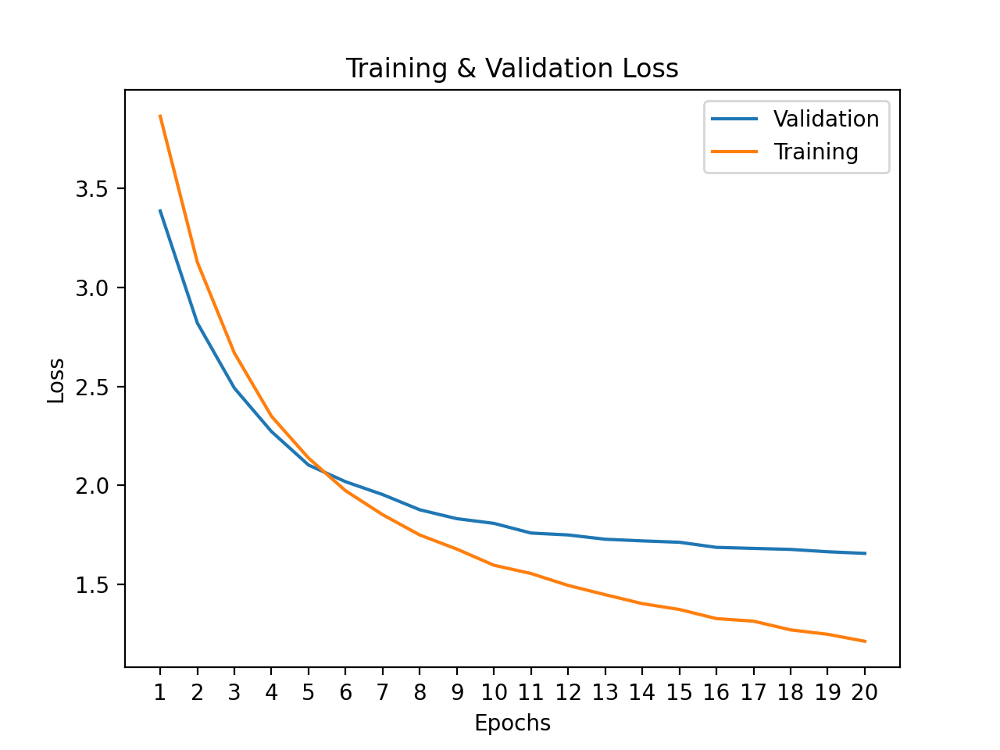

# resnet50-finetuning-and-quantization
Experiment to finetune a resnet50 model in pytorch to the MIT Indoor-67 dataset. 
Then I optimize for inference speed using 
[Pytorch's implementation](https://pytorch.org/docs/stable/quantization.html) 
of [quantization for Resnet](https://github.com/pytorch/vision/blob/master/torchvision/models/quantization/resnet.py).

